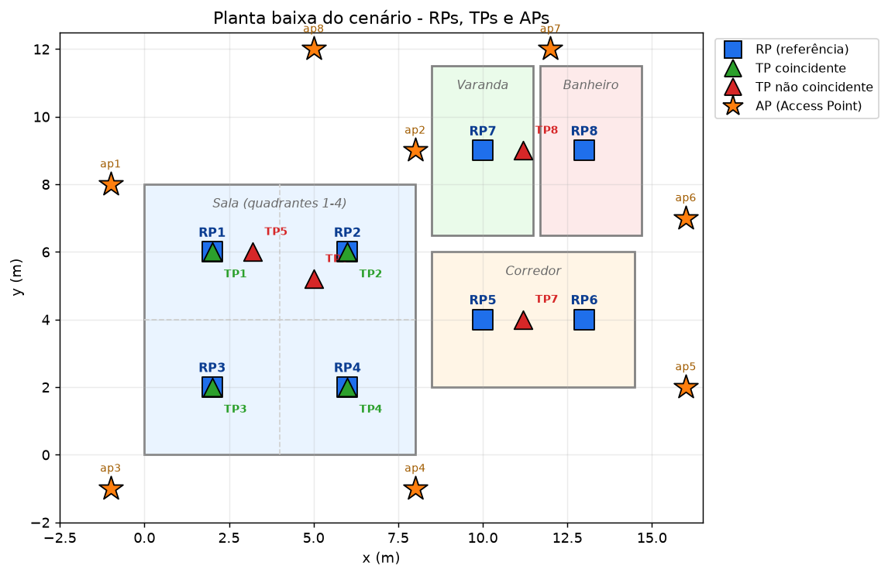
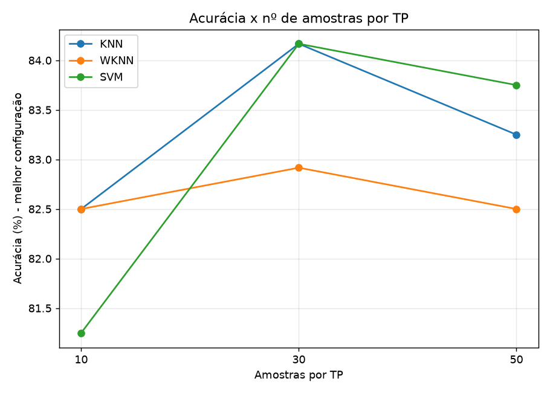

# Trabalho Final — Localização Indoor por *Fingerprinting* WiFi (RSSI)

**Disciplina:** Comunicação Sem Fio
**Tema:** Localização indoor por *fingerprinting* de RSSI usando KNN, WKNN e SVM

**Integrantes da equipe:**
- João Roberto Nogueira Menna Barreto

> **Observação sobre os dados.** A coleta física é feita com um ESP32 executando o firmware `scan (1).ino`, que varre as redes WiFi e envia os RSSIs pela porta serial; o script `csv_formatado-v2.py` lê a serial e grava os *fingerprints* filtrando apenas os APs de interesse. Como o hardware (ESP32) não estava disponível no momento de fechar este relatório, as bases foram **geradas artificialmente** por um modelo de propagação log-distância (`gerar_bases.py`), **mantendo o mesmo formato, os mesmos 8 BSSIDs reais observados** no arquivo `arquivo-rssi_dados.txt` e a mesma estrutura de colunas produzida pelo `csv_formatado-v2.py`. Os resultados de ML apresentados são **reais**, calculados sobre essas bases com `scikit-learn`.

---

## 1. Cenário Experimental

### 1.1. Planta baixa do local

O ambiente representa uma residência composta por uma **sala dividida em 4 quadrantes**, um **corredor**, uma **varanda** e um **banheiro**. A figura abaixo mostra a planta com a posição dos 8 RPs (pontos de referência), dos 8 TPs (pontos de teste) e dos 8 APs (Access Points).



- **Quadrados azuis:** RPs (usados no treinamento).
- **Triângulos verdes:** TPs coincidentes (mesma posição de um RP).
- **Triângulos vermelhos:** TPs não coincidentes (entre regiões adjacentes, mais próximos de um RP dominante).
- **Estrelas laranjas:** APs monitorados.

### 1.2. Localização dos RPs (Reference Points)

| RP  | Região                     | Coordenada (x, y) m |
|-----|----------------------------|---------------------|
| RP1 | Sala — quadrante 1 (sup. esq.) | (2, 6)          |
| RP2 | Sala — quadrante 2 (sup. dir.) | (6, 6)          |
| RP3 | Sala — quadrante 3 (inf. esq.) | (2, 2)          |
| RP4 | Sala — quadrante 4 (inf. dir.) | (6, 2)          |
| RP5 | Corredor — local 1         | (10, 4)             |
| RP6 | Corredor — local 2         | (13, 4)             |
| RP7 | Varanda                    | (10, 9)             |
| RP8 | Banheiro                   | (13, 9)             |

### 1.3. Localização dos TPs (Test Points)

São 8 TPs no total: **4 coincidentes** com RPs e **4 não coincidentes**. Conforme exigido, os não coincidentes ficam **entre regiões adjacentes, porém mais próximos de um RP específico**, de modo a avaliar a capacidade dos algoritmos de identificar a região dominante.

| TP  | Tipo             | Posição (x, y) m | Região verdadeira (`local`) | Observação                              |
|-----|------------------|------------------|-----------------------------|-----------------------------------------|
| TP1 | Coincidente      | (2, 6)           | RP1                         | Sobre o RP1                             |
| TP2 | Coincidente      | (6, 6)           | RP2                         | Sobre o RP2                             |
| TP3 | Coincidente      | (2, 2)           | RP3                         | Sobre o RP3                             |
| TP4 | Coincidente      | (6, 2)           | RP4                         | Sobre o RP4                             |
| TP5 | Não coincidente  | (3.2, 6)         | RP1                         | Entre RP1 e RP2, mais próximo de **RP1** |
| TP6 | Não coincidente  | (5, 5.2)         | RP2                         | Entre RP2 e RP3, mais próximo de **RP2** |
| TP7 | Não coincidente  | (11.2, 4)        | RP5                         | Entre RP5 e RP6, mais próximo de **RP5** |
| TP8 | Não coincidente  | (11.2, 9)        | RP7                         | Entre RP7 e RP8, mais próximo de **RP7** |

### 1.4. Identificação dos APs utilizados

Foram monitorados **8 APs** (acima do mínimo de 6 exigido), usando os BSSIDs reais observados na coleta original (`arquivo-rssi_dados.txt`). A ordem define as colunas `ap1`…`ap8`.

| Coluna | BSSID               | SSID observado           |
|--------|---------------------|--------------------------|
| ap1    | 3E:64:CF:2C:34:3A   | TFMARQUES                |
| ap2    | 3E:64:CF:4C:34:3A   | REDE TESTE AMAZON ON     |
| ap3    | E8:D2:FF:A5:B5:9B   | Celso_2G                 |
| ap4    | EA:D2:FF:A5:B7:9C   | #CLARO-WIFI              |
| ap5    | 08:C7:F5:2F:2B:64   | RANDY2G                  |
| ap6    | 84:0B:BB:E4:E2:B2   | VIVOFIBRA                |
| ap7    | 3A:1F:48:54:4C:50   | #CLARO-WIFI              |
| ap8    | 30:1F:48:54:4C:50   | fernandaRafael           |

---

## 2. Construção das Bases

### 2.1. Processo de coleta

O fluxo real de coleta é:

1. **ESP32 (`scan (1).ino`)** — a cada 3 s, executa `WiFi.scanNetworks()` e envia pela serial as linhas `SCAN_ID,SSID,BSSID,CHANNEL,RSSI`, terminando cada varredura com `END_SCAN` (cada `END_SCAN` = 1 *fingerprint*).
2. **`csv_formatado-v2.py`** — lê a serial, filtra apenas os 8 BSSIDs monitorados (APs ausentes recebem RSSI = **−100**), monta o vetor `[ap1…ap8]` e grava com `tipo`, `ponto` e `local`. Parâmetros usados: `TIPO_PONTO` (RP/TP), `PONTO_ID`, `LOCAL_REAL` e `NUM_LEITURAS = 50`.

Para este relatório, o processo foi reproduzido pelo `gerar_bases.py`, que modela o RSSI médio de cada AP em cada posição via **modelo log-distância**:

```
RSSI(d) = P0 − 10 · n · log10(d)   [dBm]
```

onde `P0` é a potência de referência a 1 m e `n` o expoente de perda de percurso (2,6–3,0, típico de ambientes indoor). A cada *fingerprint* é somado um ruído gaussiano (*shadowing*, σ = 3 dB); valores abaixo da sensibilidade (−92 dBm) são tratados como AP não detectado (−100 dBm). Isso reproduz a variabilidade real do RSSI.

### 2.2. Quantidade de *fingerprints*

- **50 *fingerprints* por RP** × 8 RPs = **400 amostras de treino**.
- **50 *fingerprints* por TP** × 8 TPs = **400 amostras de teste**.

### 2.3. Estrutura das bases

Ambas seguem o formato de saída do `csv_formatado-v2.py`:

```
ap1,ap2,ap3,ap4,ap5,ap6,ap7,ap8,tipo,ponto,local
-52,-65,-63,-62,-82,-76,-75,-66,RP,RP1,RP1   ← exemplo (treino)
-54,-59,-67,-62,-74,-73,-74,-64,TP,TP1,RP1   ← exemplo (teste)
```

- **Base de treino:** `wifi_train_50_por_rp_com_local.csv`
- **Base de teste:** `wifi_test_50_por_rp_com_local.csv`
- `tipo` ∈ {RP, TP}; `ponto` é o identificador físico (RP1…, TP1…); `local` é a **classe/região verdadeira** (o RP dominante), que é o alvo da classificação.

**RSSI médio (dBm) por RP na base de treino** (assinaturas distinguíveis):

| Ponto | ap1  | ap2  | ap3  | ap4  | ap5  | ap6  | ap7  | ap8  |
|-------|------|------|------|------|------|------|------|------|
| RP1   | −52,5| −62,5| −64,9| −64,5| −75,8| −72,5| −75,3| −65,4|
| RP2   | −61,1| −54,7| −68,8| −62,4| −72,1| −68,5| −71,1| −63,9|
| RP3   | −59,9| −66,2| −59,5| −61,6| −74,6| −72,5| −77,2| −70,2|
| RP4   | −63,0| −64,1| −66,5| −53,6| −70,9| −69,9| −75,0| −70,2|
| RP5   | −66,4| −59,5| −72,2| −59,3| −65,9| −62,8| −71,0| −70,0|
| RP6   | −67,8| −63,1| −73,8| −62,2| −57,6| −57,1| −70,1| −72,0|
| RP7   | −64,9| −48,4| −73,5| −66,2| −69,9| −62,7| −59,6| −62,6|
| RP8   | −68,1| −58,9| −74,6| −67,1| −67,9| −55,1| −58,2| −68,1|

---

## 3. Configuração dos Algoritmos

Os dados de entrada são padronizados com `StandardScaler` (ajustado no treino e aplicado ao teste). A padronização coloca todos os APs em escala comparável — indispensável para o SVM-RBF e benéfica para a distância euclidiana do KNN/WKNN.

### 3.1. KNN (K-Nearest Neighbors)
- **K (nº de vizinhos):** 1, 3, 5, 7
- **Métrica de distância:** Euclidiana
- **Peso:** uniforme (todos os vizinhos com o mesmo peso)

### 3.2. WKNN (Weighted KNN)
- **K (nº de vizinhos):** 1, 3, 5, 7
- **Métrica de distância:** Euclidiana
- **Peso:** inverso da distância (`weights="distance"`) — vizinhos mais próximos pesam mais

### 3.3. SVM (Support Vector Machine)
- **Kernel:** linear e RBF
- **C (penalização):** 1 e 10
- **Gamma:** `scale` (ajuste automático com base na variância dos dados)

Os experimentos foram executados para **10, 30 e 50 amostras (*fingerprints*) por TP**, conforme a tabela de cenários obrigatórios.

---

## 4. Resultados

As métricas de **Precision, Recall e F1-Score** são reportadas em **média macro** (média entre as classes, tratando todas as regiões com igual importância). Todos os valores em %.

### 4.1. Tabela geral de métricas (todas as configurações e cenários)

| Algoritmo | Configuração            | Amostras/TP | Accuracy | Precision | Recall | F1     |
|-----------|-------------------------|:-----------:|:--------:|:---------:|:------:|:------:|
| KNN       | K=1                     | 10          | 78,75    | 68,59     | 58,13  | 61,26  |
| KNN       | K=3                     | 10          | 77,50    | 69,46     | 56,88  | 60,44  |
| KNN       | **K=5**                 | 10          | **82,50**| 69,77     | 61,25  | 63,98  |
| KNN       | K=7                     | 10          | 81,25    | 68,27     | 61,25  | 63,51  |
| WKNN      | K=1                     | 10          | 78,75    | 68,59     | 58,13  | 61,26  |
| WKNN      | K=3                     | 10          | 77,50    | 69,17     | 56,88  | 60,18  |
| WKNN      | **K=5**                 | 10          | **82,50**| 69,77     | 61,25  | 63,98  |
| WKNN      | K=7                     | 10          | 80,00    | 68,27     | 60,00  | 62,59  |
| SVM       | linear, C=1             | 10          | 81,25    | 68,30     | 60,62  | 63,07  |
| SVM       | linear, C=10            | 10          | 81,25    | 69,49     | 60,00  | 63,12  |
| SVM       | rbf, C=1                | 10          | 81,25    | 68,26     | 60,62  | 63,22  |
| SVM       | rbf, C=10               | 10          | 81,25    | 67,80     | 61,25  | 63,23  |
| KNN       | K=1                     | 30          | 80,42    | 67,97     | 58,96  | 62,15  |
| KNN       | K=3                     | 30          | 79,58    | 68,89     | 57,71  | 61,54  |
| KNN       | **K=5**                 | 30          | **84,17**| 70,37     | 61,46  | 64,74  |
| KNN       | K=7                     | 30          | 83,33    | 69,00     | 61,46  | 64,31  |
| WKNN      | K=1                     | 30          | 80,42    | 67,97     | 58,96  | 62,15  |
| WKNN      | K=3                     | 30          | 80,00    | 68,93     | 57,92  | 61,66  |
| WKNN      | K=5                     | 30          | 82,92    | 69,48     | 60,62  | 63,90  |
| WKNN      | K=7                     | 30          | 82,50    | 68,97     | 60,62  | 63,68  |
| SVM       | linear, C=1             | 30          | 84,17    | 69,72     | 61,46  | 64,44  |
| SVM       | linear, C=10            | 30          | 82,50    | 69,78     | 60,42  | 63,83  |
| SVM       | **rbf, C=1**            | 30          | **84,17**| 70,13     | 61,46  | 64,72  |
| SVM       | rbf, C=10               | 30          | 81,67    | 68,61     | 60,21  | 63,24  |
| KNN       | K=1                     | 50          | 79,25    | 66,73     | 58,38  | 61,53  |
| KNN       | K=3                     | 50          | 78,75    | 67,69     | 57,38  | 61,01  |
| KNN       | **K=5**                 | 50          | **83,25**| 69,85     | 60,88  | 64,21  |
| KNN       | K=7                     | 50          | 83,00    | 69,39     | 61,00  | 64,12  |
| WKNN      | K=1                     | 50          | 79,25    | 66,73     | 58,38  | 61,53  |
| WKNN      | K=3                     | 50          | 79,00    | 67,44     | 57,62  | 61,18  |
| WKNN      | **K=5**                 | 50          | **82,50**| 69,14     | 60,38  | 63,61  |
| WKNN      | K=7                     | 50          | 82,00    | 69,16     | 60,00  | 63,26  |
| SVM       | linear, C=1             | 50          | 83,50    | 69,31     | 61,00  | 64,05  |
| SVM       | linear, C=10            | 50          | 82,75    | 69,43     | 60,38  | 63,82  |
| SVM       | **rbf, C=1**            | 50          | **83,75**| 70,20     | 61,25  | 64,60  |
| SVM       | rbf, C=10               | 50          | 82,75    | 69,06     | 60,88  | 63,94  |

> Tabela completa também disponível em `resultados_metricas.csv`.

### 4.2. Melhor configuração por algoritmo (cenário 50 amostras/TP)

| Algoritmo | Melhor configuração | Accuracy | Precision | Recall | F1     |
|-----------|---------------------|:--------:|:---------:|:------:|:------:|
| KNN       | K = 5               | 83,25    | 69,85     | 60,88  | 64,21  |
| WKNN      | K = 5               | 82,50    | 69,14     | 60,38  | 63,61  |
| SVM       | RBF, C = 1          | **83,75**| **70,20** | 61,25  | 64,60  |

### 4.3. Acurácia × número de amostras por TP



### 4.4. Matrizes de Confusão (melhores modelos, 50 amostras/TP)

As classes com zero linhas (RP6 e RP8) não possuem TP de teste associado — nenhum TP tem `local` = RP6 ou RP8 —, mas aparecem como **coluna de predição** por serem regiões vizinhas para onde os TPs não coincidentes "vazam".

**KNN (K=5)** — `fig_matriz_confusao_KNN.png`

| real \ pred | RP1 | RP2 | RP3 | RP4 | RP5 | RP6 | RP7 | RP8 |
|-------------|:---:|:---:|:---:|:---:|:---:|:---:|:---:|:---:|
| **RP1** (TP1+TP5) | 92 | 5 | 3 | 0 | 0 | 0 | 0 | 0 |
| **RP2** (TP2+TP6) | 7 | 87 | 1 | 3 | 2 | 0 | 0 | 0 |
| **RP3** (TP3)     | 1 | 0 | 48 | 1 | 0 | 0 | 0 | 0 |
| **RP4** (TP4)     | 0 | 1 | 3 | 46 | 0 | 0 | 0 | 0 |
| **RP5** (TP7)     | 0 | 0 | 0 | 0 | 31 | 19 | 0 | 0 |
| **RP7** (TP8)     | 0 | 0 | 0 | 0 | 0 | 0 | 29 | 21 |

**WKNN (K=5)** — `fig_matriz_confusao_WKNN.png`

| real \ pred | RP1 | RP2 | RP3 | RP4 | RP5 | RP6 | RP7 | RP8 |
|-------------|:---:|:---:|:---:|:---:|:---:|:---:|:---:|:---:|
| **RP1** | 91 | 6 | 3 | 0 | 0 | 0 | 0 | 0 |
| **RP2** | 5 | 86 | 2 | 4 | 3 | 0 | 0 | 0 |
| **RP3** | 1 | 0 | 48 | 1 | 0 | 0 | 0 | 0 |
| **RP4** | 0 | 1 | 3 | 46 | 0 | 0 | 0 | 0 |
| **RP5** | 0 | 0 | 0 | 0 | 30 | 20 | 0 | 0 |
| **RP7** | 0 | 0 | 0 | 0 | 0 | 0 | 29 | 21 |

**SVM (RBF, C=1)** — `fig_matriz_confusao_SVM.png`

| real \ pred | RP1 | RP2 | RP3 | RP4 | RP5 | RP6 | RP7 | RP8 |
|-------------|:---:|:---:|:---:|:---:|:---:|:---:|:---:|:---:|
| **RP1** | 89 | 8 | 3 | 0 | 0 | 0 | 0 | 0 |
| **RP2** | 4 | 91 | 1 | 3 | 1 | 0 | 0 | 0 |
| **RP3** | 1 | 0 | 47 | 2 | 0 | 0 | 0 | 0 |
| **RP4** | 0 | 1 | 2 | 47 | 0 | 0 | 0 | 0 |
| **RP5** | 0 | 0 | 0 | 0 | 31 | 19 | 0 | 0 |
| **RP7** | 0 | 0 | 0 | 0 | 0 | 0 | 30 | 20 |

### 4.5. Acurácia: TPs coincidentes × não coincidentes (por cenário)

| Algoritmo | Config       | Amostras | Acc. coincidentes (%) | Acc. não coincidentes (%) |
|-----------|--------------|:--------:|:---------------------:|:-------------------------:|
| KNN       | K=5          | 10       | 97,50                 | 67,50                     |
| KNN       | K=5          | 30       | 95,83                 | 72,50                     |
| KNN       | K=5          | 50       | 95,00                 | 71,50                     |
| WKNN      | K=5          | 10       | 97,50                 | 67,50                     |
| WKNN      | K=5          | 30       | 95,83                 | 70,00                     |
| WKNN      | K=5          | 50       | 95,00                 | 70,00                     |
| SVM       | rbf, C=1     | 10       | 95,00                 | 67,50                     |
| SVM       | rbf, C=1     | 30       | 95,00                 | 73,33                     |
| SVM       | rbf, C=1     | 50       | 95,50                 | 72,00                     |

> Tabela completa em `acuracia_coinc_vs_naocoinc.csv`.

---

## 5. Discussão

### 5.1. KNN × WKNN × SVM

- Os três algoritmos ficaram próximos, com acurácia global entre **~78% e ~84%**. No cenário de 50 amostras/TP, o **SVM-RBF (C=1)** obteve a melhor acurácia (83,75%) e o melhor F1 (64,60%), seguido de perto pelo **KNN (K=5, 83,25%)**.
- **KNN × WKNN:** foram praticamente equivalentes. Como as assinaturas RSSI dos RPs são bem separadas, ponderar pelo inverso da distância (WKNN) não trouxe ganho consistente; em alguns casos o WKNN ficou levemente abaixo, pois o peso extra nos vizinhos mais próximos amplifica o ruído quando o *fingerprint* de teste cai numa fronteira entre regiões.
- **Efeito do K:** K=1 e K=3 sofreram mais com o ruído (menor acurácia); **K=5 foi o melhor** equilíbrio viés/variância, com leve queda em K=7.
- **SVM:** o kernel **RBF com C=1** teve o melhor desempenho; aumentar para **C=10 piorou** ligeiramente, indício de leve *overfitting* (fronteira mais rígida) — coerente com a observação da tabela de parâmetros do enunciado. O kernel linear também foi competitivo, mostrando que as classes são quase linearmente separáveis no espaço padronizado.

### 5.2. TPs coincidentes × não coincidentes

Esta é a diferença mais marcante dos resultados:

- **TPs coincidentes:** acurácia **~95%** em todos os algoritmos — quando o TP está exatamente sobre o RP, sua assinatura RSSI é quase idêntica à de treino e a classificação é altamente confiável.
- **TPs não coincidentes:** acurácia cai para **~67%–73%**. As matrizes de confusão mostram claramente o motivo: os erros se concentram nas **regiões adjacentes**. TP7 (entre RP5 e RP6) é confundido com **RP6** em ~40% das amostras, e TP8 (entre RP7 e RP8) com **RP8** em ~40%. Isso é esperado e desejável do ponto de vista físico: nas fronteiras entre regiões, os RSSIs se tornam ambíguos. Ainda assim, o **RP dominante correto** foi identificado na maioria das amostras, cumprindo o objetivo de detectar a "região dominante de localização".

### 5.3. 10 × 30 × 50 amostras por TP

- Aumentar de **10 → 30** amostras melhorou a acurácia (ex.: KNN K=5 de 82,50% para 84,17%), pois mais amostras reduzem o impacto de *fingerprints* ruidosos isolados.
- De **30 → 50** a acurácia estabilizou (leve variação para baixo em alguns casos), indicando **saturação**: a partir de ~30 amostras por TP, a avaliação já é estatisticamente representativa e mais amostras não agregam informação nova, apenas confirmam a tendência.

---

## 6. Conclusão

- **Melhor algoritmo:** o **SVM com kernel RBF (C=1, gamma=scale)** apresentou o melhor desempenho global (acurácia 83,75% e F1 64,60% no cenário de 50 amostras/TP), com o **KNN (K=5)** logo atrás e praticamente empatado. Para uma implementação simples e de baixo custo computacional, o **KNN K=5** é uma excelente escolha; para máxima acurácia, o **SVM-RBF**.
- **Melhor configuração encontrada:** K = 5 para KNN/WKNN e RBF com C = 1 para SVM. Valores de K menores (1, 3) e C = 10 no SVM degradaram o desempenho.
- **Principais dificuldades observadas:**
  - Ambiguidade de RSSI nas **fronteiras entre regiões**, que domina os erros dos TPs não coincidentes.
  - Sensibilidade dos algoritmos ao **ruído/*shadowing*** do sinal, mais crítico com K pequeno.
  - Necessidade de **padronização** dos RSSIs para o bom funcionamento do SVM-RBF.
- **Análise crítica:** o experimento confirma o princípio central do *fingerprinting*: a qualidade da localização depende diretamente de o ponto de teste "cair" dentro da assinatura de um RP conhecido. Para pontos coincidentes o desempenho é excelente (~95%); para pontos entre regiões, a resposta correta passa a ser a **região dominante**, e os erros são fisicamente coerentes (sempre com o RP vizinho). O número de amostras por TP tem retorno decrescente após ~30, e a diferença entre KNN, WKNN e SVM é pequena neste cenário de classes bem separadas — o SVM leva ligeira vantagem por definir fronteiras de decisão mais robustas. Em um cenário real, com mais interferência e sobreposição de sinais, espera-se que a vantagem do SVM e do uso de mais APs se torne mais expressiva.

---

## 7. Como reproduzir

Os arquivos-fonte estão neste diretório. Para reexecutar tudo:

```bash
# 1) criar ambiente e instalar dependências
python3 -m venv .venv
.venv/bin/pip install numpy pandas scikit-learn matplotlib

# 2) gerar as bases (treino e teste)
.venv/bin/python gerar_bases.py

# 3) rodar os algoritmos de ML e gerar métricas/figuras
.venv/bin/python classificar_ml.py

# 4) gerar a planta baixa e as matrizes de confusão em texto
.venv/bin/python planta_e_matrizes.py
```

### Arquivos do projeto

| Arquivo                                   | Descrição                                                        |
|-------------------------------------------|------------------------------------------------------------------|
| `scan (1).ino`                            | Firmware do ESP32 para varredura WiFi (coleta real)             |
| `csv_formatado-v2.py`                     | Leitura da serial e formatação dos *fingerprints* (coleta real) |
| `gerar_bases.py`                          | Gerador das bases fictícias (modelo log-distância)             |
| `classificar_ml.py`                       | KNN, WKNN e SVM + métricas + figuras                            |
| `planta_e_matrizes.py`                    | Planta baixa e matrizes de confusão em texto                   |
| `wifi_train_50_por_rp_com_local.csv`      | Base de treino (8 RPs × 50 *fingerprints*)                      |
| `wifi_test_50_por_rp_com_local.csv`       | Base de teste (8 TPs × 50 *fingerprints*)                       |
| `resultados_metricas.csv`                 | Métricas de todas as configurações/cenários                    |
| `acuracia_coinc_vs_naocoinc.csv`          | Acurácia coincidentes × não coincidentes                       |
| `fig_planta_baixa.png`                    | Planta baixa do cenário                                         |
| `fig_matriz_confusao_{KNN,WKNN,SVM}.png`  | Matrizes de confusão dos melhores modelos                      |
| `fig_acuracia_x_amostras.png`             | Acurácia × amostras por TP                                      |
